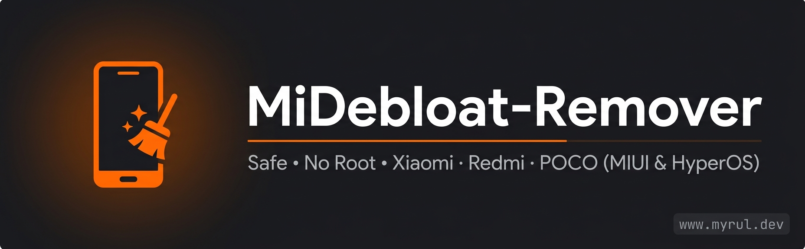

<div align="center">



# MiDebloat-Remover (MDR)

**Bersihkan aplikasi bawaan (bloatware) HP Xiaomi, Redmi & POCO — TANPA ROOT.**
CLI sederhana berbahasa Indonesia, jalan di **Termux + Shizuku (rish)**.

[-3DDC84?logo=android&logoColor=white)](#)
[](#)
[](#)
[](#)
[](LICENSE)

🌐 **Website:** [www.myrul.dev](https://www.myrul.dev) · 📘 **Facebook:** [/myruldev](https://web.facebook.com/myruldev)

</div>

---

## 📌 Apa ini?

**MiDebloat-Remover (MDR)** adalah alat untuk **menonaktifkan aplikasi bawaan**
Xiaomi/Redmi/POCO yang tidak kamu butuhkan (bloatware) supaya HP lebih ringan, hemat baterai,
dan lebih privat — **tanpa perlu root** dan **tanpa menghapus paksa**.

Aplikasi hanya **dinonaktifkan** (disable) memakai perintah resmi Android:
```
pm disable-user --user 0 nama.paket
```
dan bisa **dipulihkan** kapan saja:
```
pm enable nama.paket
```

> ⚠️ **Aman & bisa dibatalkan.** Aplikasi tidak benar-benar dihapus, jadi kalau ada yang keliru,
> tinggal pulihkan lewat menu **Restore Debloat** atau **Restore dari File Backup**.

---

## ✨ Fitur Utama
*   ✅ **Debloat Aman** (hanya `disable`, tidak uninstall, tidak merusak sistem).
*   🛡️ **Whitelist Sistem** — paket vital (SystemUI, Settings, GMS, SecurityCenter, Launcher, dsb.) **otomatis dilindungi** dan tidak akan tersentuh.
*   🔎 **Scan & Status Paket** — cek dulu paket target mana yang `AKTIF / OFF / tidak ada` sebelum debloat.
*   💾 **Backup Otomatis** — sebelum disable, daftar paket disimpan ke `backup/backup-YYYYMMDD-HHMMSS.txt`.
*   📝 **Log Aksi** — semua aksi tercatat di `logs/actions.log` dan bisa dilihat dari menu.
*   ✅ **Daftar Debloat Diperluas** — iklan (MSA), telemetri, Fashion Gallery/Glance, App Vault, Facebook stub, Google TV/One, Mi Cloud, Mi Share, Mi Pay, Theme Store, dsb.
*   ✅ **Deteksi Otomatis** model perangkat, **region/varian ROM** (China/Global/EEA/India/Indonesia), versi **MIUI / HyperOS**, serta **statistik paket** (total & jumlah yang ter-disable) secara real-time.
*   ⚠️ **Proteksi Salah Perangkat** — peringatan + konfirmasi otomatis jika HP bukan keluarga Xiaomi/Redmi/POCO.
*   🎯 **Restore Pilihan** — kembalikan aplikasi tertentu saja (mis. Mi Music, Mi Video) tanpa harus restore semua.
*   🚀 **Optimasi Kecepatan Animasi** (`0.5x`) untuk UI yang terasa jauh lebih responsif.
*   🧹 **Clean System** (menghentikan background apps & membersihkan cache sistem).
*   🎮 **Game Mode ON / OFF** (fixed performance mode jika didukung).
*   🔋 **Ultra-Hemat Baterai** (membatasi sync & pemindaian latar belakang).
*   📊 **Monitor RAM & CPU** real-time via `top`.
*   🔁 **Restore Penuh** dari daftar paket maupun dari file backup.
*   🛡️ **Tanpa Root** — memakai API sistem via Shizuku.

---

## 📱 Perangkat yang Didukung
*   Semua seri **Xiaomi**, **Redmi**, dan **POCO** (MIUI / HyperOS).
*   Android 10 hingga Android 14+ (termasuk HyperOS pada Redmi Note 13 Pro+ 5G).

---

## 🧰 Persyaratan
1.  **Termux** (disarankan versi F-Droid)
    👉 [Termux F-Droid](https://f-droid.org/packages/com.termux/)
2.  **Shizuku**
    👉 [Shizuku di Play Store](https://play.google.com/store/apps/details?id=moe.shizuku.privileged.api)
3.  **Shizuku dalam keadaan RUNNING**
4.  **rish (Shizuku shell) sudah terpasang** (Tes dengan `rish -c id` harus berhasil).
    👉 *Bingung atau error saat pasang `rish`? Lihat **[Panduan Setup Rish & Troubleshooting](docs/troubleshooting.md)**.*

---

## 🚀 Instalasi & Cara Menjalankan
1.  Unduh script `mdr.sh` ke Termux Anda.
2.  Beri izin eksekusi:
    ```bash
    chmod +x mdr.sh
    ```
3.  Jalankan:
    ```bash
    ./mdr.sh
    ```

---

## 🧭 Panduan Menu
| No | Menu | Keterangan |
|----|------|------------|
| 1  | **Scan & Status Paket** | Cek status paket target (AKTIF/OFF/tidak ada) sebelum debloat. |
| 2  | **Debloat AMAN** | Iklan (MSA), telemetri, Fashion Gallery, App Vault, Facebook stub, Google TV/One, Mi Pay, dsb. |
| 3  | **Debloat AMAN + Optional** | Tambahan app bawaan: GetApps, Mi Video/Music/Browser, Mi Cloud, Mi Share, Theme Store, dll. |
| 4  | **Debloat ADVANCED** | Joyose, MiuiDaemon, PowerKeeper. *Baca peringatan dulu!* |
| 5  | **Clean** | Tutup background apps + bersihkan cache sistem. |
| 6/7 | **Game Mode ON/OFF** | Fixed performance mode (jika didukung). |
| 8/9 | **Ultra Battery ON/OFF** | Batasi sync & background scan. |
| 10 | **Monitor RAM/CPU** | Pantau proses real-time via `top`. |
| 11/12 | **Speed Up / Restore Animations** | Animasi `0.5x` ↔ `1.0x`. |
| 13 | **Restore Debloat** | Aktifkan kembali SEMUA paket. |
| 14 | **Restore PILIHAN** | Pilih aplikasi spesifik untuk dikembalikan (mis. Mi Music, Mi Video). |
| 15 | **Restore dari File Backup** | Pulihkan dari `backup/backup-*.txt`. |
| 16 | **Lihat Log Aksi** | Tampilkan `logs/actions.log`. |

---

## 💡 Rekomendasi Urutan Penggunaan (HyperOS & Redmi Note 13 Series)
Untuk performa maksimal, baterai awet, dan UI responsif:

1.  **Menu `1` (Scan & Status)** — lihat dulu paket apa saja yang aktif di HP-mu.
2.  **Menu `2` (Debloat AMAN)** — bersihkan iklan sistem (MSA), telemetri (Analytics), Wallpaper Carousel, App Vault, dan bug report tanpa efek samping.
3.  **Menu `11` (Speed Up Animations 0.5x)** — sangat dianjurkan untuk layar 120Hz; transisi terasa **2x lipat lebih instan**.
4.  **Menu `5` (Clean)** — bersihkan cache & tutup background apps secara berkala.
5.  *(Opsional)* **Menu `3` (Debloat AMAN + Optional)** — jika kamu tidak memakai app bawaan Xiaomi (GetApps, Mi Video/Music/Cloud) dan pakai alternatif Google/pihak ketiga.

> [!WARNING]
> **Hindari Menu `4` (Advanced)** kecuali benar-benar diperlukan untuk gaming berat.
> Mematikan Joyose di sebagian versi HyperOS bisa mengunci refresh rate layar pada aplikasi tertentu.

---

## 🛡️ Keamanan & Disclaimer
*   Script **tidak menghapus file sistem permanen**, hanya menonaktifkan (`disable-user`) untuk user 0.
*   Paket sistem penting **dilindungi whitelist** dan tidak akan dinonaktifkan.
*   Sebelum disable, daftar paket dibackup otomatis ke `backup/`. Semua aksi dicatat di `logs/actions.log`.
*   Jika ada masalah, pulihkan lewat menu **Restore** atau via ADB komputer:
    ```bash
    adb shell pm install-existing <nama_paket>
    ```
*   **Gunakan dengan risiko ditanggung sendiri (DWYOR — Do With Your Own Risk).**

---

<div align="center">

Dibuat dengan ❤️ oleh **myrul.dev**

🌐 [www.myrul.dev](https://www.myrul.dev) · 📘 [facebook](https://web.facebook.com/myruldev)

⭐ Kalau bermanfaat, kasih bintang di GitHub ya!

</div>
